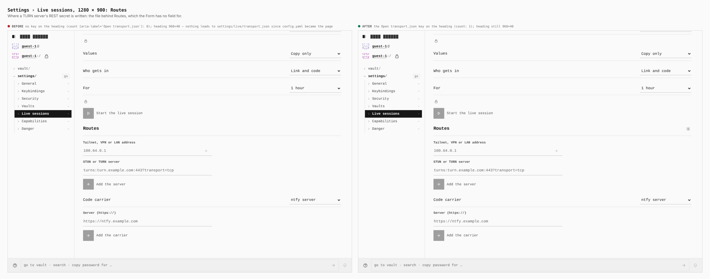
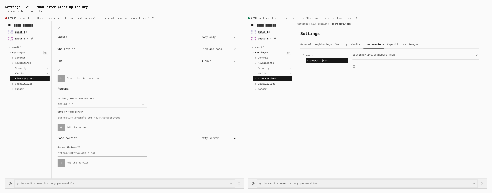
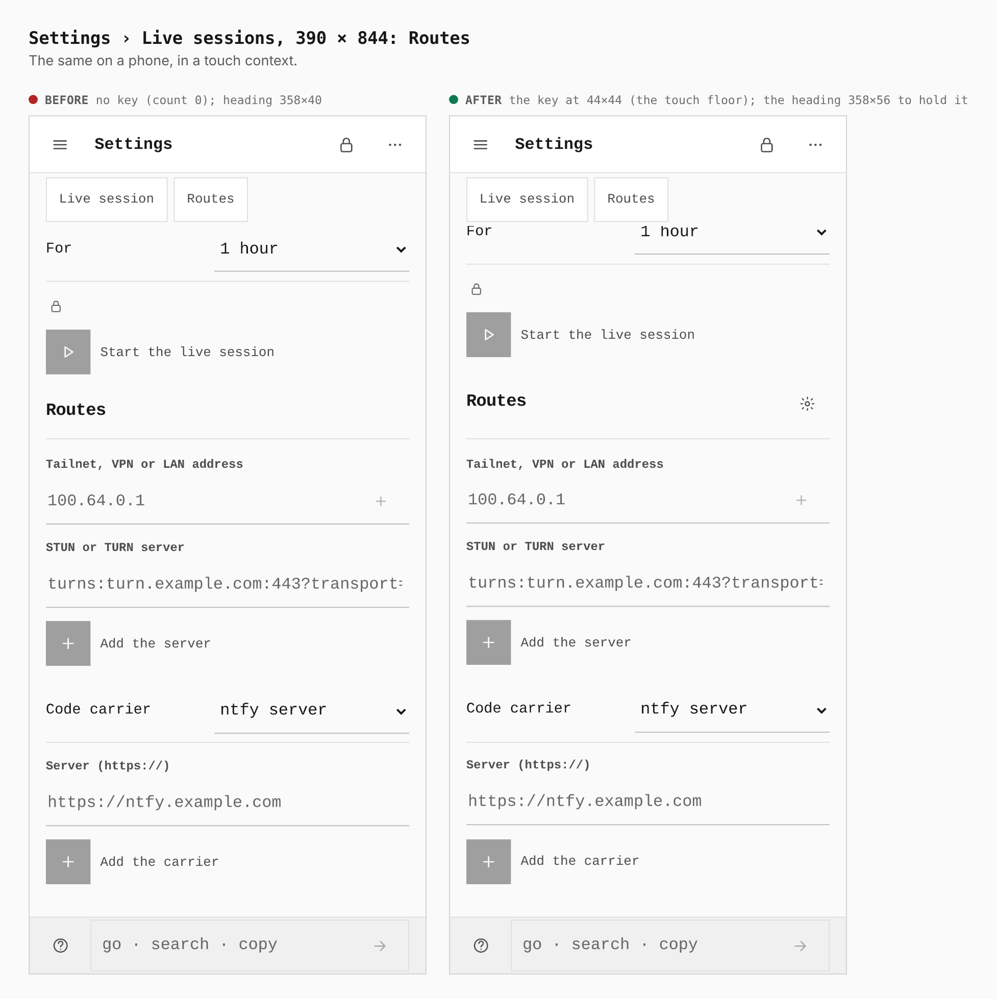
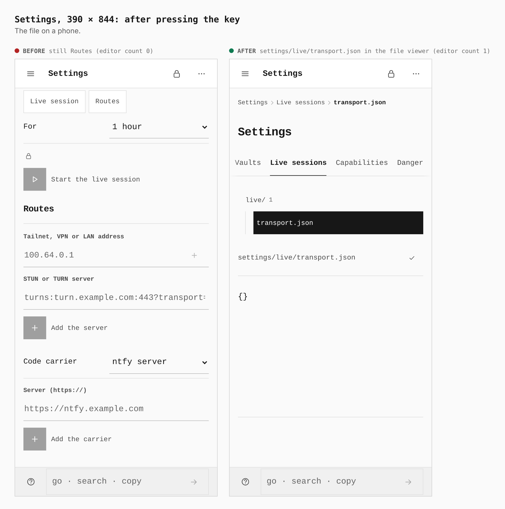

# Live join across three browsers: the road to transport.json

Before and after images come from two real builds, walked by the same journey
(`journey.json`, `apps/pages/scripts/capture-evidence.mjs`). The base is `main`
at `2631dcb` and the other build is this branch. The journey enters as a guest,
switches Live sessions on, opens Settings › Live sessions, scrolls to Routes and
presses the file key. Measurements are taken from the browser; the phone width
runs in a touch context.

The only on-screen change on this branch is one icon key. **Open
transport.json** sits on the Routes heading and opens
`settings/live/transport.json` in the file viewer. That file is the only place
a TURN server's REST secret is written (ADR 0150 §6). On 2026-10-06 a
directory's `config.yaml` became the page itself (ADR 0134), and since then
nothing led to the file. `verify:live-join`'s TURN REST walk failed on `main`
for that reason. The key is also drawn over a profile the panel cannot read,
because the file is where such a profile gets fixed.

The rest of this branch has no visible change: the CI job, the
three-browser walk, zod running jitless, the wordmark resizing on the next frame,
and MQTT on native timers. See [ADR 0187](../../adr/0187-live-join-walked-in-ci-across-browsers.md).

## Routes, 1280 × 900

| | before | after |
|---|---|---|
| key on the heading | absent (count 0) | present (count 1) |
| Routes heading | 960×40 | 960×40, unchanged |

## After pressing the key, 1280 × 900

| | before | after |
|---|---|---|
| file editor | no key to press, still on Routes (count 0) | `settings/live/transport.json` in the file viewer (count 1) |

## Routes, 390 × 844

| | before | after |
|---|---|---|
| key on the heading | absent (count 0) | 44×44, the touch floor |
| Routes heading | 358×40 | 358×56, to hold the key |

## After pressing the key, 390 × 844

| | before | after |
|---|---|---|
| file editor | still on Routes (count 0) | `settings/live/transport.json` in the file viewer (count 1) |

## Verified besides the images

- `verify:live-join` was run as each of its three CI shards: Chromium, Firefox
  and WebKit as owner, each paired with all three as joiner. The ADR records
  each walk an engine cannot take here, and the run prints it as `NOT TAKEN`.
- `LiveRoutesPanel.test.tsx` covers the key on a readable profile and on an
  unreadable one.
