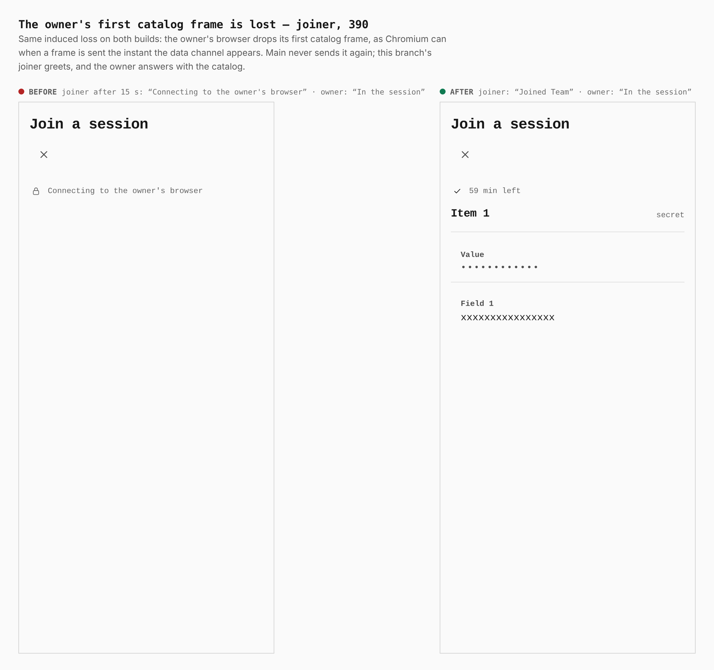
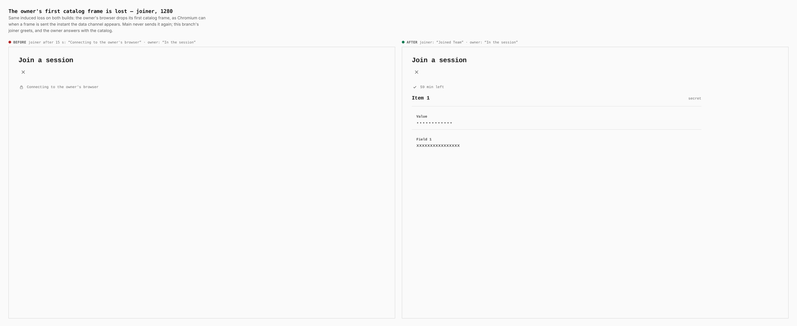
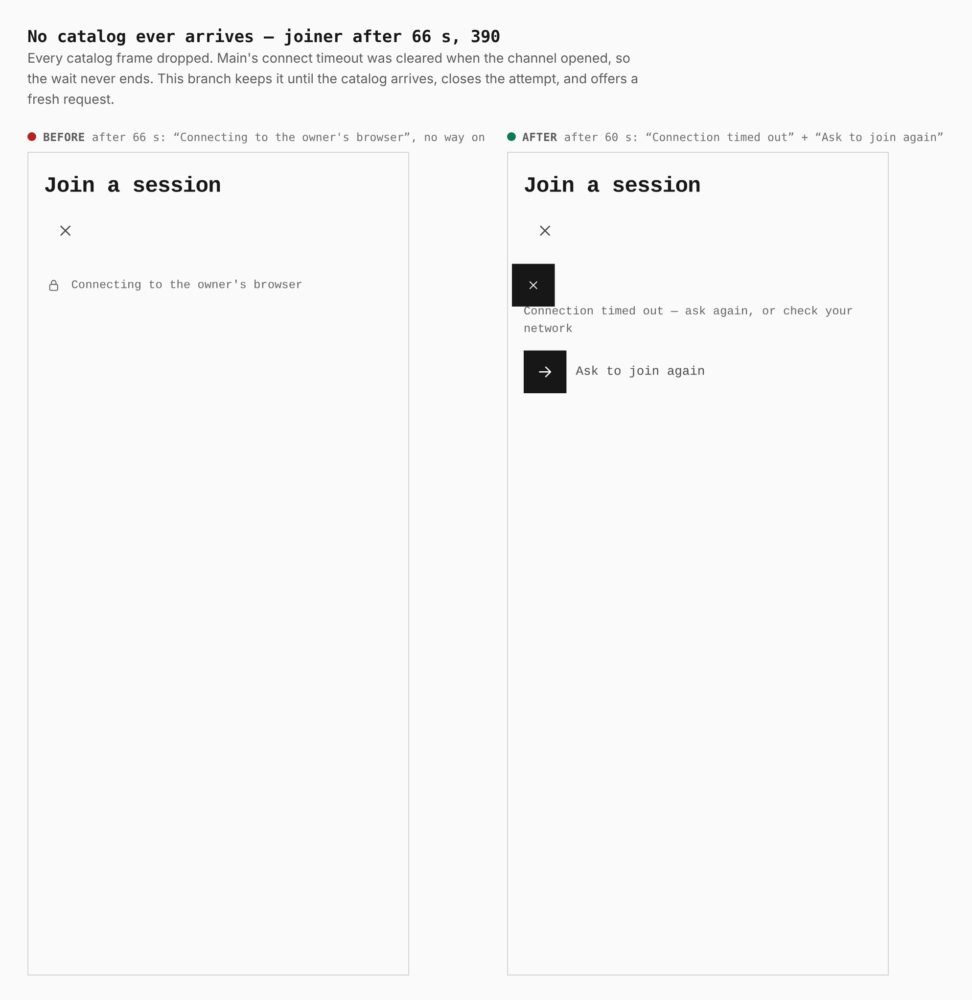
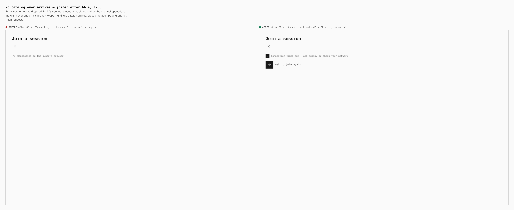
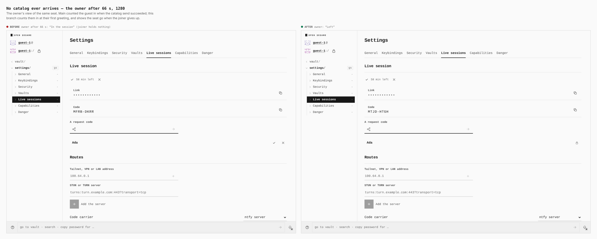

# Live join: the catalog answers a greeting (ADR 0186)

Before/after from two real builds — `main` (8388301) and this branch — walked
by the same journey (`journey.json`, `apps/pages/scripts/capture-evidence.mjs`):
an owner hosts an invite session from a guest vault, a joiner in a browser of
its own opens the link, gives the code and is let in by hand, and the two
connect over real WebRTC.

**The loss is induced.** The stall this fixes is intermittent: Chromium can
drop the first frame a side sends the moment its data channel appears (2 in
240 pairings in a standalone repro; 3 failures in 23 runs of
`verify:live-join`'s direct walk on `main`). To show it every time, the
`liveLose` step makes the owner's browser drop its outgoing catalog frames —
the first one, or all of them. Nothing else is touched.

## The owner's first catalog frame is lost — joiner, 390

`main`: after 15 s the joiner still reads *Connecting to the owner's browser*,
while the owner reads *In the session*. This branch: *Joined Team*, the
catalog shown — the joiner greeted again, and the owner answered.

## The owner's first catalog frame is lost — joiner, 1280

The same at desktop width.

## No catalog ever arrives — joiner after 66 s, 390

`main`: *Connecting to the owner's browser* after 66 s, with no way on — its
60 s connect timeout was cleared when the channel opened. This branch: at
60 s, *Connection timed out* and the **Ask to join again** key with its verb,
which makes a fresh request for the owner to let in.

## No catalog ever arrives — joiner after 66 s, 1280

The same at desktop width.

## No catalog ever arrives — the owner after 66 s, 1280

`main`: Ada is *In the session* (the check mark, with the remove key) though
she holds nothing. This branch: Ada has *Left* — the owner counts a guest in
at their first greeting, and sees the seat go when the joiner gives up.
