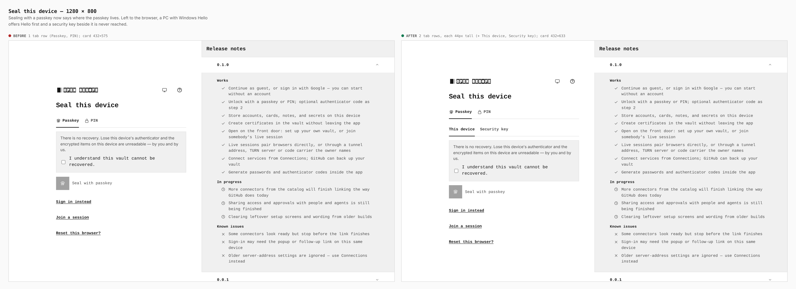
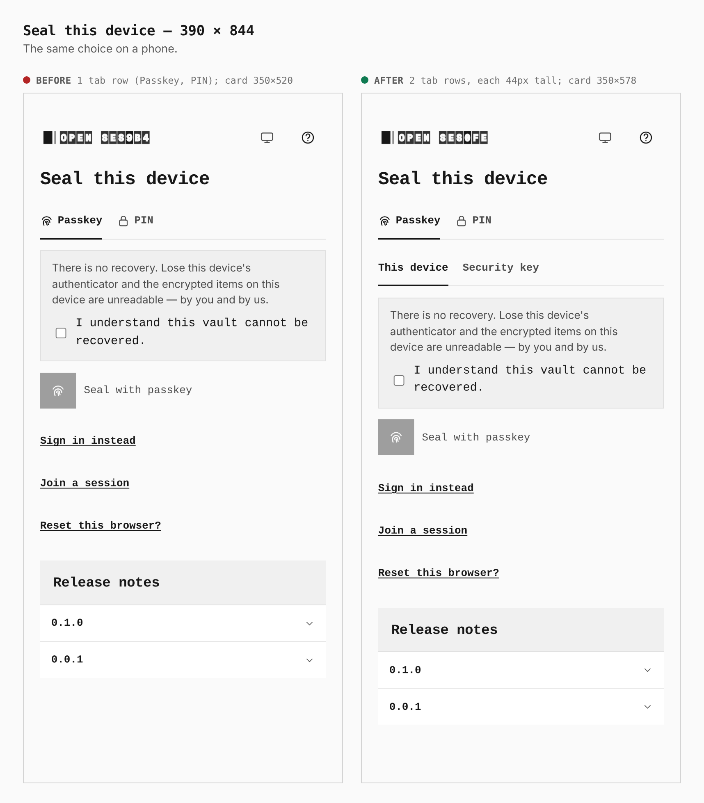
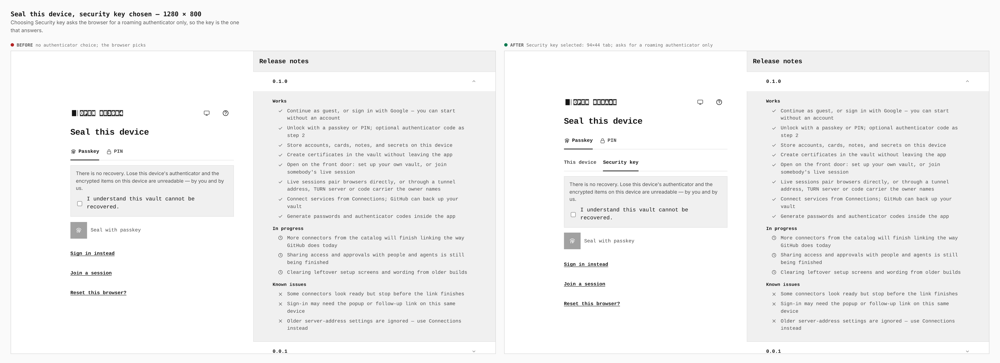
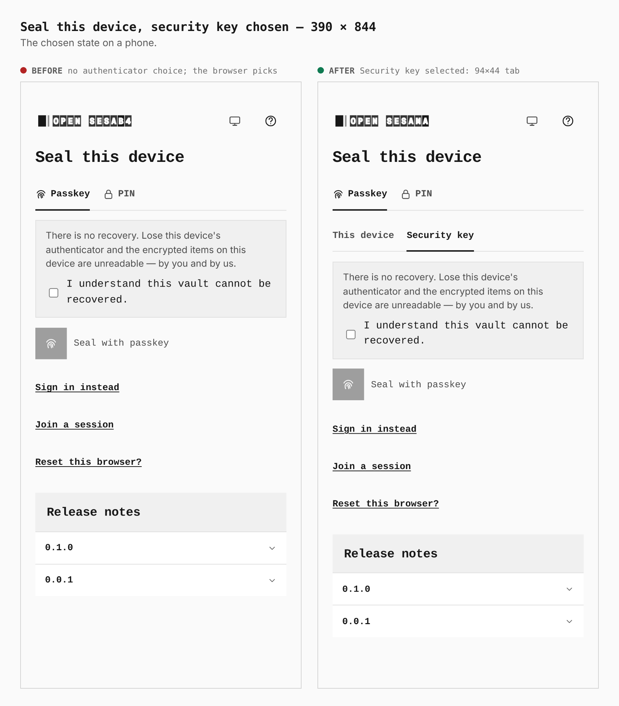
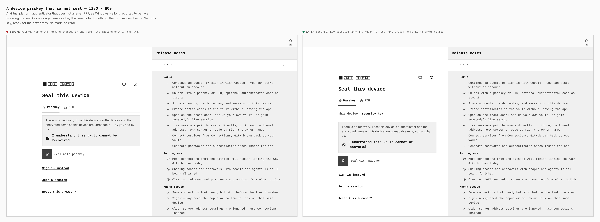
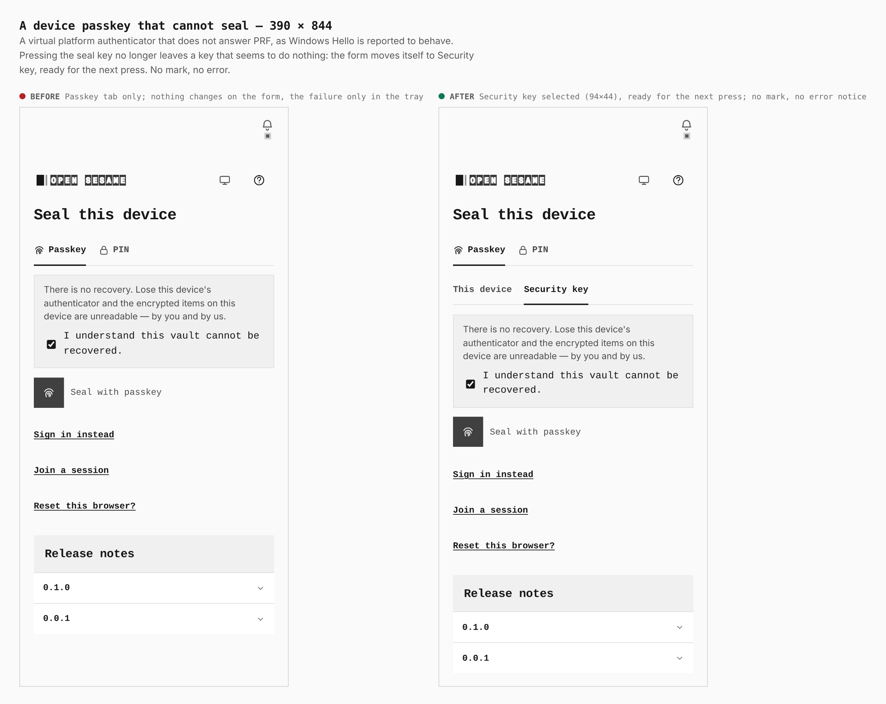

# Sealing with a security key, and a seal that moves on instead of failing

Before/after from two real builds — `main` (`8388301`) and this branch — walked
the same way: past the front door, "Use without an account", the first-run seal
form. Measurements are taken from the browser in a touch context; `journey.json`
holds the steps and the claims each sheet makes.

What changed on screen:

- The Passkey tab of the first-run seal draws a second row, **This device /
  Security key**, that names where the passkey lives. It reuses the unlock tab
  styling, so each tab is already 44px tall.
- A passkey seal that an authenticator cannot answer no longer ends on a key
  that seems to do nothing. The form moves itself on — to Security key after
  This device, to the PIN road after a security key — and draws no error.
  The tray carries one plain info line saying why.

## Seal this device

| | before | after |
|---|---|---|
| 1280 × 800 | 1 tab row (Passkey, PIN); card 432×575 | 2 tab rows, each 44px tall; card 432×633 |
| 390 × 844 | 1 tab row; card 350×520 | 2 tab rows, each 44px tall; card 350×578 |

## Security key chosen

The selected tab is 94×44 at both widths. Choosing it asks the browser for a
roaming authenticator only (`authenticatorAttachment: "cross-platform"`), so
Windows Hello is not offered ahead of a key.

## A device passkey that cannot seal

The capture installs a virtual platform authenticator that does not answer the
WebAuthn PRF extension — how Windows Hello is reported to behave, not a
recording of it — ticks the acknowledgement and presses **Seal with passkey**.

| | before | after |
|---|---|---|
| 1280 × 800 | Passkey tab only; nothing changes on the form, the failure only in the tray | Security key selected (94×44), ready for the next press |
| 390 × 844 | the same | the same |

No mark, no error text and no error notice appear in the page or the tray; the
tray holds an info line ("This device's passkey cannot seal a vault. Security
key is selected."). A security key that cannot answer PRF moves the form to the
PIN road the same way (covered by `UnlockScreen.passkey-kind.test.tsx`; the
capture harness has no virtual security key without PRF).

## What these do not show

No real Windows Hello and no real YubiKey were available. The ceremony was
exercised in Chromium against CDP virtual authenticators (a USB key with PRF, an
internal one without) — see the pull request.
