# Settings › Trusted contacts (ADR 0187) — visual evidence

Before/after from two real production builds of Pages, walked the same way
from `journey.json`. The before is `main` at
`115a39a30964ecee743c0482be189ae1106ccc00`; the after is this branch at
`fc0e13b14e79ad76370f00cefe1c42d663ab8698` (a clean build of that commit
produces the same 221 hashed asset files as the `apps/pages/dist` that was
captured; the two commits after it, `ed57496` and `4e08f9f`, change only
the `reason` text of two exclusions in `packages/capability-registry`, which none
of these screens draws). Every measurement is a line the capture printed from the browser
(`count`, `measure`, `labels`, `report` steps in `journey.json`).

Trusted contacts is net-new, so the before is honest absence: the same steps,
on a base build that has no such switch, tab, key or sheet. Each step after the
switch is optional on the base, so the pair is the same walk, not two walks.
Every walk seals a vault with a PIN: guest, decoy and locked vaults draw none
of these panels by design.

Ten sheets are two-build pairs, five topics at the phone (390 × 844, a touch
context) and at the desktop (1280 × 800, a mouse). The last four are not pairs;
see [Populated screens](#populated-screens-from-the-five-browser-gate).

## The tab appears — 1280 × 800

Switching Trusted contacts on in Settings › Capabilities › Sharing adds a tile,
and Settings gains one tab. The base build has no switch.

**Before:** Trusted contacts switch 0 found; 6 tabs (General, Keybindings,
Security, Vaults, Capabilities, Danger). **After:** switch 1 found, on, 38×22;
7 tabs, Trusted contacts between Vaults and Capabilities.

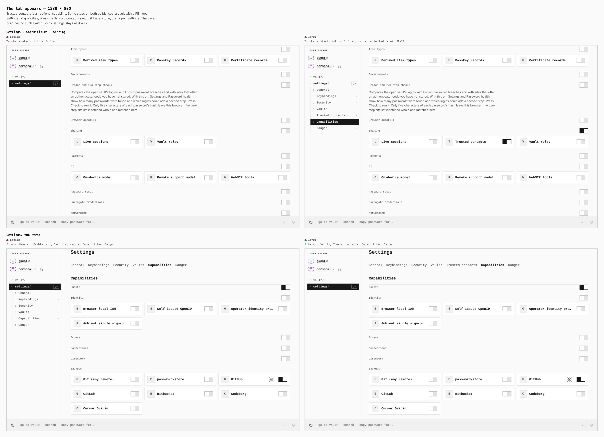

## The tab appears — 390 × 844

The same on a phone. The switch is 44×44 and the seventh tab runs off the edge
of the strip, which scrolls sideways.

**Before:** switch 0 found; 6 tabs. **After:** switch 1 found, on, 44×44; 7 tabs.

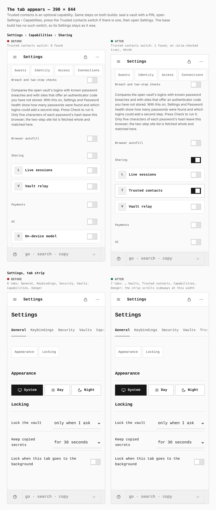

## The empty tab — 1280 × 800

Three panels for the three sides of a circle: Circles (the owner's), Guarding
(a guardian's) and Recovery (a recipient's), each with the keys that start a
ceremony and a mark that says there is nothing yet.

**Before:** 0 panels, no head keys. **After:** 3 panels; head keys 24×24
(Circles 1, Guarding 3, Recovery 1); marks “No circles yet.” · “Nothing held for
anyone yet.” · “No recoveries in progress.”

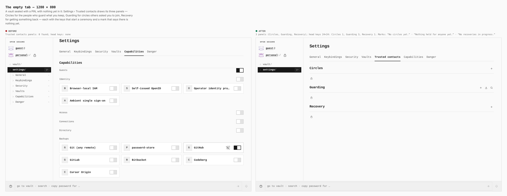

## The empty tab — 390 × 844

**Before:** 0 panels, no head keys. **After:** 3 panels; every head key 44×44
(Circles 1, Guarding 3, Recovery 1); the same three marks.

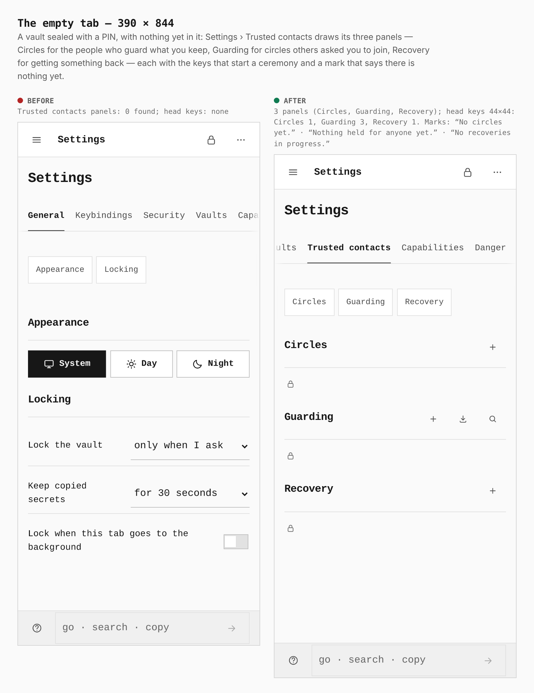

## Start a circle — 1280 × 800

The Circles key opens a sheet at the right edge. Step 1 names the circle and
says what it protects; making the invitation shows it as one line to copy and
as a QR code.

**Before:** no Start a circle key, no sheet, no QR code. **After:** sheet 424×800
at 856,0; QR code 144×144.

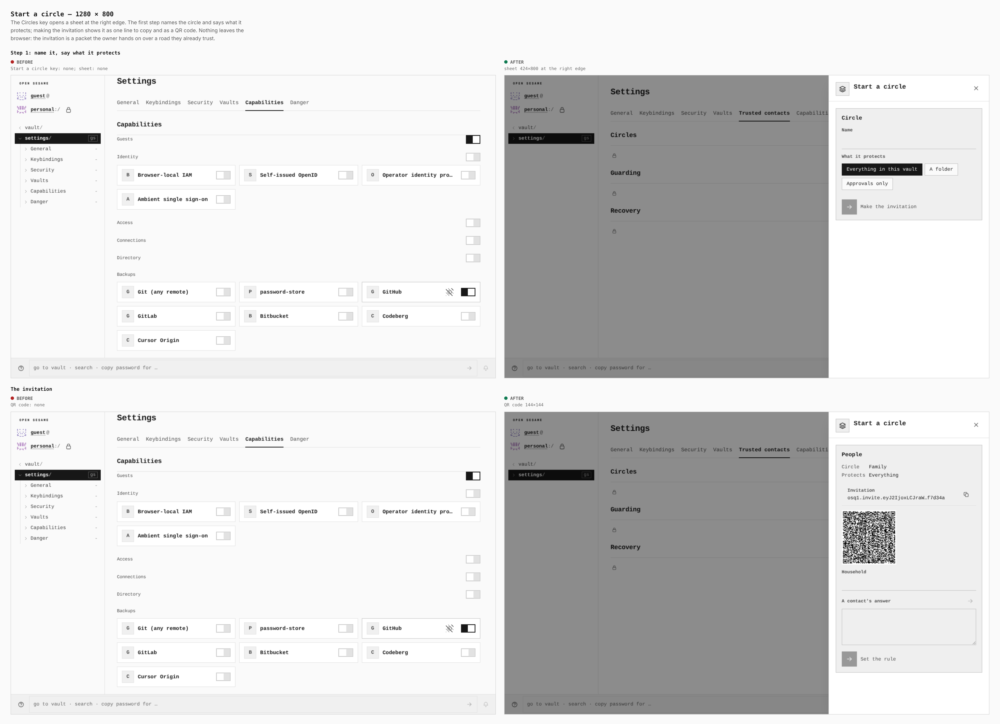

## Start a circle — 390 × 844

**Before:** no key, no sheet, no QR code. **After:** a sheet from the bottom
edge, 390×445 at 0,399; QR code 144×144.

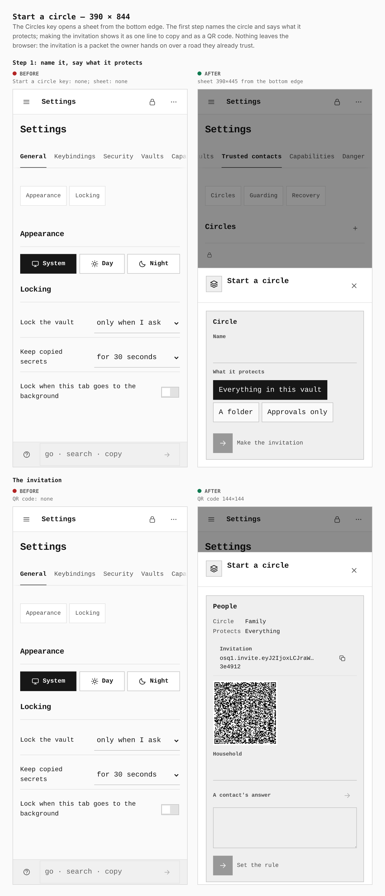

## A refused paste — 1280 × 800

Accept an invitation takes a pasted packet. An invitation with a broken check
(`osq1.invite.eyJ2IjoxfQ.000000`) is refused where it was pasted: a mark on the
field, and nothing drawn in the page.

**Before:** not on this build. **After:** one error mark, 20×20 beside a 94×18
label; its label is “This packet was cut off or changed on the way.”;
`[role="alert"]` 0, `.note--err` 0.

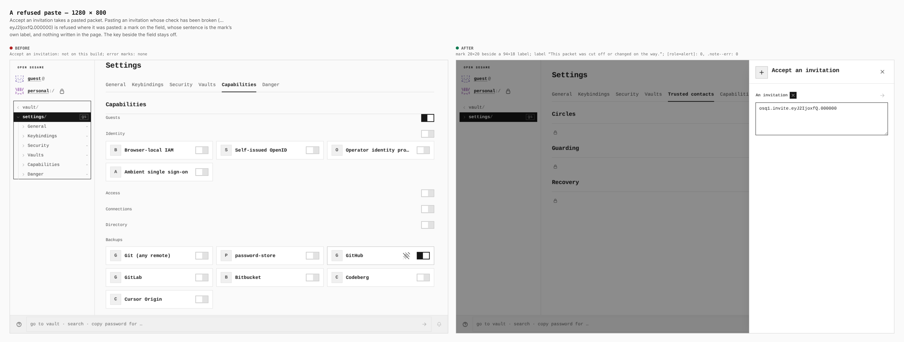

## A refused paste — 390 × 844

**Before:** not on this build. **After:** the same mark and sentence, `[role="alert"]`
0, `.note--err` 0. The mark is 44×44 at 106,688 and the label is 94×18 at
18,701, so the mark's touch target overlaps the end of the label by 6px (the
label reads “An invitatio” under it). **The sheet below is the capture as found.**
It was fixed afterwards: the packet field's label row keeps 0.8rem between the
label and the mark under a finger, and `verify:mobile` now asserts the clearance
and prints it — `390-trusted-contacts-refused: label-to-mark target gap 0.796875px`
(it was −6px). That check is a measurement from the browser on the fixed build;
this image was not re-captured.

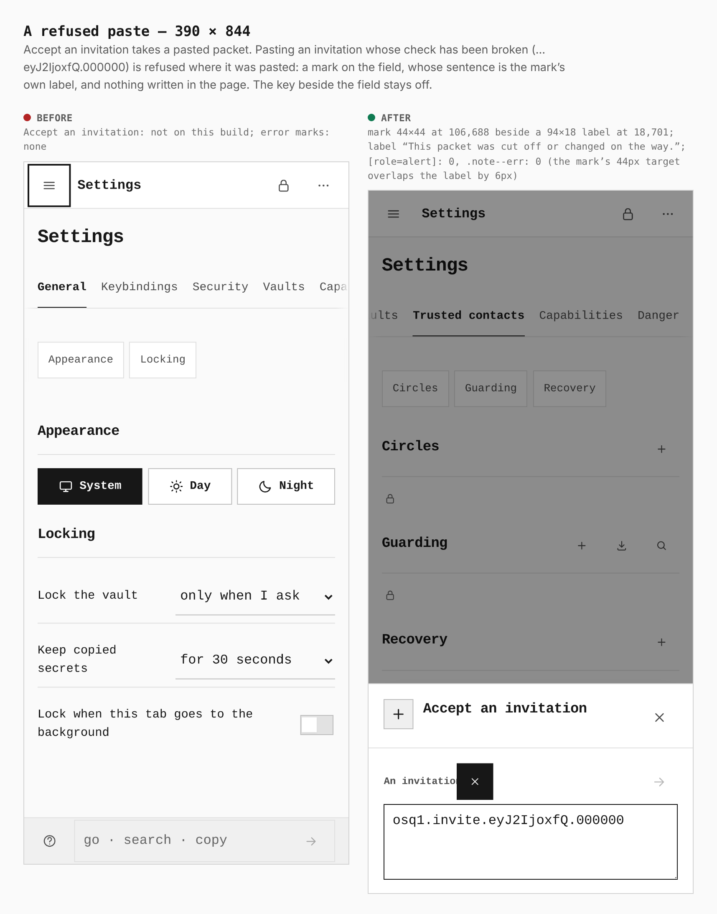

## Start a recovery — 1280 × 800

The Recovery key opens a sheet for the recovery file the owner saved and a name
for this device. Send stays off until a file has been read.

**Before:** no key, no sheet. **After:** sheet 424×800 at 856,0.

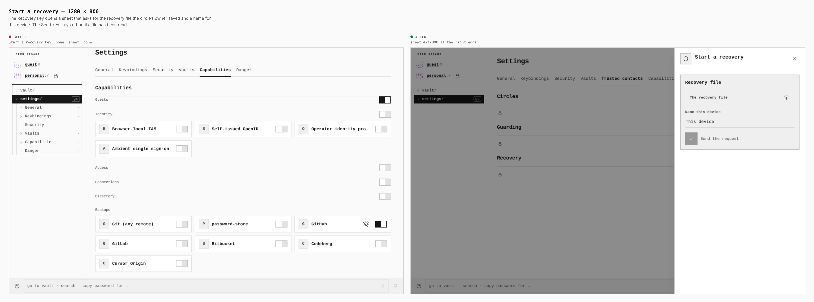

## Start a recovery — 390 × 844

**Before:** no key, no sheet. **After:** a sheet from the bottom edge, 390×381
at 0,463.

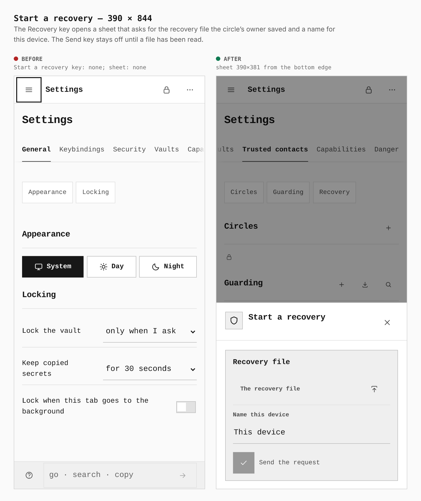

## Populated screens, from the five-browser gate

These four are **after only**, and they do not come from the two-build pair. A
circle with people in it, a request, a recovery in progress and a recovered row
need four other people's packets, which a two-build walk can only stage by
faking them, and nothing here is faked or placed by hand. They are screenshots
from `pnpm --filter @opensesame/pages verify:trusted-contacts`: an owner, three
guardians and a recipient, each in a browser of their own with a virtual
security key, passing packets by the clipboard, on this build (the same
`apps/pages/dist`). The base build has no such screen, so there is nothing to
put beside them. Their notes quote the page text each screenshot was saved with.

The gate's 390 run is a 390-wide viewport with a mouse, not a touch context: it
shows the walk fits the width. Touch sizes are measured in the paired sheets
above.

To regenerate them, run the gate at `WIDTH=1280` and `WIDTH=390` (it writes to
`/tmp/opensesame-trusted-contacts-verification/<width>/`) and compose with
`EVIDENCE_GATE_DIR=/tmp/opensesame-trusted-contacts-verification`.

### Owner and guardian — 1280 × 900

The owner's circle armed (“Family · 2 of 3 · epoch 1 · 3 contacts”, a packet each
for Ada, Bo and Cy), and a guardian's circle held with a request on it and an
approval refused (the gate's “key not verified” step).


### Recipient — 1280 × 900

A recovery in progress (“Family · 2 approved · 0 released”), and the recovered
row (“Family · Recovered”) with the Import sheet it opens.

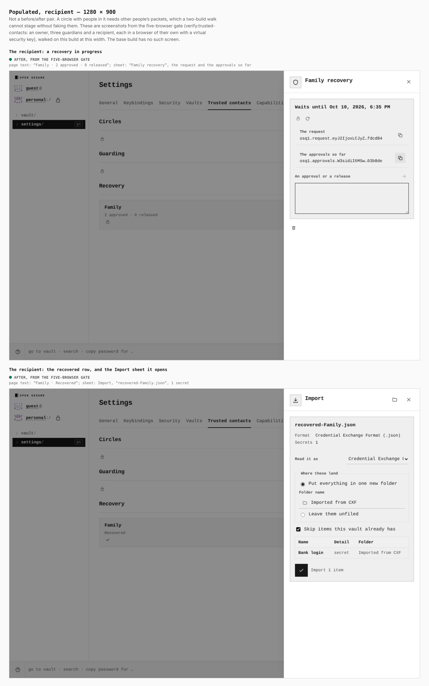

### Owner and guardian — 390 × 900

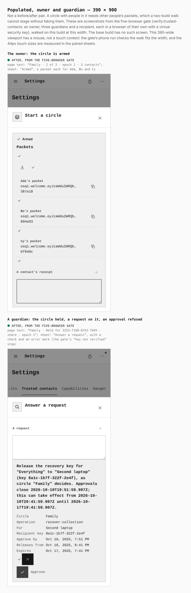

### Recipient — 390 × 900

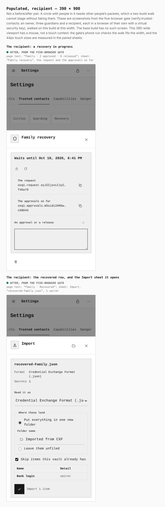

## How these were made

```bash
J=docs/evidence/2026-10-10-trusted-contacts/journey.json

# the base: its own worktree, so no checkout is swapped
git worktree add --detach /tmp/tc-base origin/main
(cd /tmp/tc-base && pnpm install --frozen-lockfile --offline \
  && VITE_BASE=/OpenSesame/ pnpm exec turbo run build --filter=@opensesame/pages)
EVIDENCE_DIST=/tmp/tc-base/apps/pages/dist PLAYWRIGHT_CHROMIUM=/opt/pw-browsers/chromium \
  node apps/pages/scripts/capture-evidence.mjs capture before "$J"

# the branch: apps/pages/dist built from this tree
PLAYWRIGHT_CHROMIUM=/opt/pw-browsers/chromium \
  node apps/pages/scripts/capture-evidence.mjs capture after "$J"

# the sheets (the gate's screenshots are read from EVIDENCE_GATE_DIR)
EVIDENCE_GATE_DIR=/tmp/opensesame-trusted-contacts-verification \
PLAYWRIGHT_CHROMIUM=/opt/pw-browsers/chromium \
  node apps/pages/scripts/capture-evidence.mjs compose "$J"
```

`apps/pages/scripts/lib/visual-evidence.mjs` learned two things for this
gallery: a sheet may stack several steps as `rows`, and a row may name a `gate`
screenshot instead of a base capture.
