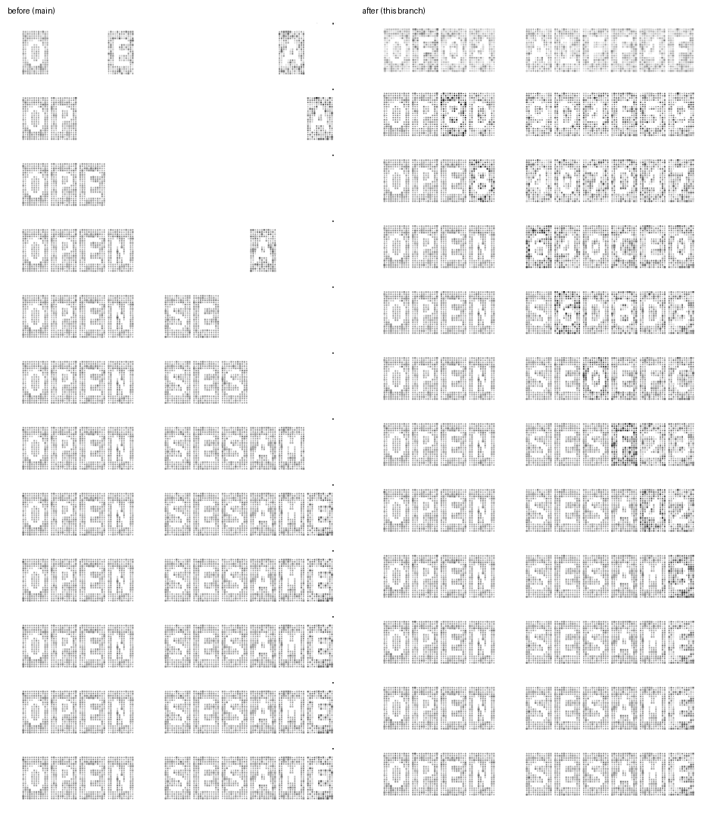

# Wordmark decode: every slot visible from the first frame

The hero wordmark decodes from a hex cipher: every slot cycles cipher glyphs while a cursor walks the slots one at a time and locks each on its letter. The particle tier drew a slot only when it had a mask for the glyph on it, and masks were built for the word's letters alone. A slot showing `0`–`9`, `B`, `C`, `D` or `F` was skipped, so undecoded slots drew blank and the word seemed to slide in letter by letter. Masks are now built for the whole cipher alphabet too.

## Front door, 1280 × 900, one frame every 220 ms

Left: `main` at `1a6adbe0`. Right: this branch. Same build steps (`VITE_BASE=/OpenSesame/`), same harness, the canvas clipped to its own box.

| Frame (ms) | 0 | 220 | 440 | 660 | 880 | 1100 | 1320 | 1540 | 1760 |
|---|---|---|---|---|---|---|---|---|---|
| Plates drawn, `main` (of 10) | 3 | 3 | 3 | 5 | 6 | 7 | 9 | 10 | 10 |
| Plates drawn, this branch (of 10) | 10 | 10 | 10 | 10 | 10 | 10 | 10 | 10 | 10 |

Measured from the frames: the ink in the middle 70% of each slot's column, with the space excluded.

The solid tier (16–48px, a phone's hero) draws each glyph with `fillText` and was never affected.
