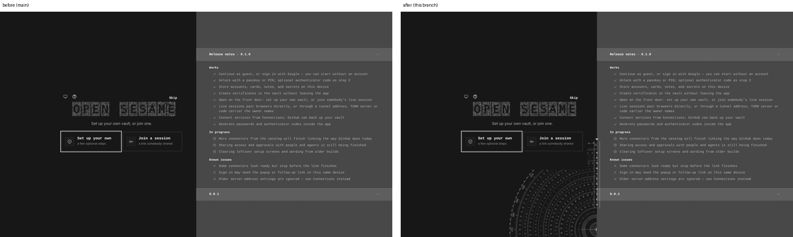
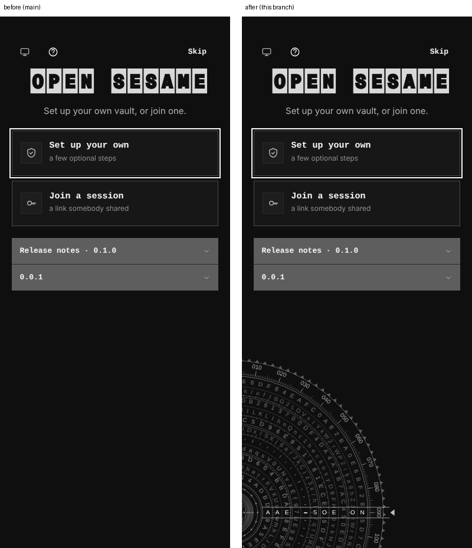
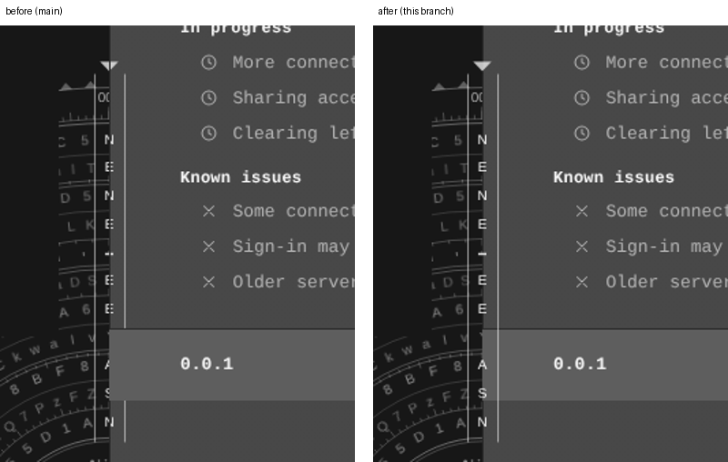

# Lock-v5: the shimmer runs on, the dial is on the front door, the key is in front

Three corrections to the lock-v5 title screens:

1. **The shimmer keeps running after the decode settles.** The particle field froze the moment the last letter locked, and the unlock hero was mounted `static`, so it never decoded or shimmered at all. The field now keeps its shimmer for as long as it is on screen (particle tier only; reduced motion still holds it still), and the unlock hero decodes on arrival as it did on the approved branch.
2. **The cipher dial is on the front door.** The first screen had no dial; it now idles behind the card as on every other lock-v5 gate (`useIdleDial`).
3. **The cipher key is in front.** The dial was one stacking context at `z-index: 0`, so its key (index and readout) sat under the release notes and the `0.0.1` row cut it. The dial no longer makes its own stacking context: the rings stay behind the card and notes, the key sits above them.

Two real builds, `main` at `f98d9915` and this branch, same harness and steps.

## Front door, 1560 × 900, dark

## Front door, 390 × 900, dark

## Unlock gate, the key against the notes, 1560 × 900, dark (crop at 1.5×)

## Measured in the browser

| | `main` | This branch |
|---|---|---|
| Front door 1560: wordmark canvas changes between two settled frames 700 ms apart | no | yes |
| Front door 1280: the same | no | yes |
| Unlock hero 1560: the same | no | yes |
| Front door: cipher dial canvases | 0 | 13 |
| Unlock: key overlay `z-index` against notes `2` | 2 (inside the dial's own context, under the notes) | 4 (above notes and card) |

At 390 the hero is the solid-plate tier, which has no particle field, so it is still by design.
