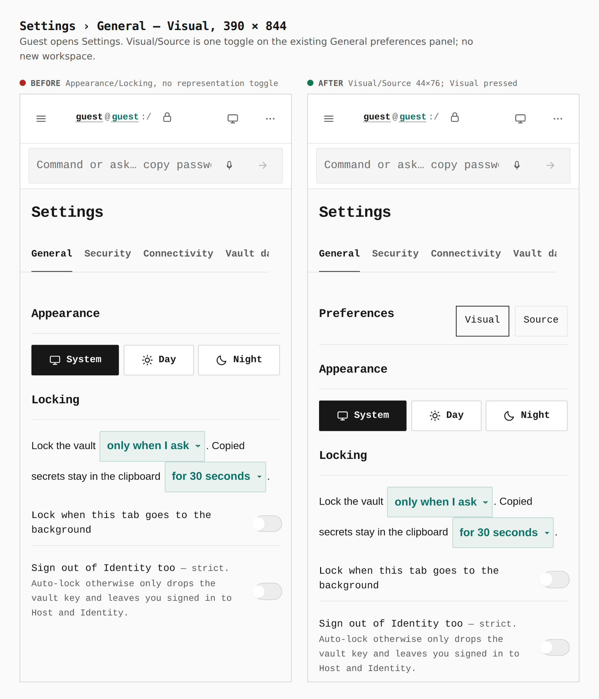
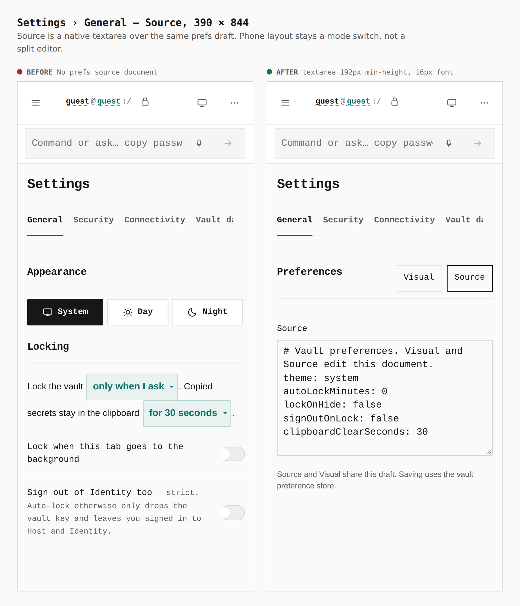
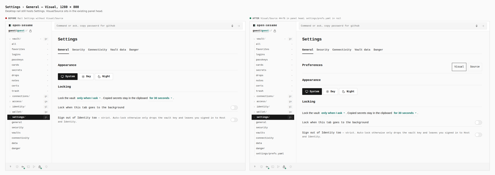
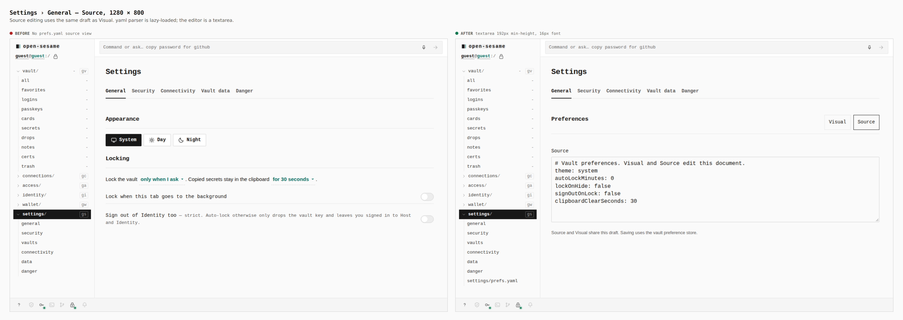

# Visual evidence — Visual / Source preferences

Before/after from two real Pages builds under `/OpenSesame/`, walked as a guest into Settings › General. **Before** is `acd64dfea3d055f96f9f9477f1b3658978ebe245` (`git merge-base HEAD origin/main`). **After** is this worktree’s Pages source. Phone 390 × 844 (coarse pointer) and desktop 1280 × 800.

Measurements taken from the after dist in Chromium (`getBoundingClientRect` / computed style):

| control | 390 | 1280 |
| --- | --- | --- |
| Visual / Source buttons | 44 × 76 | 44 × 76 |
| Source textarea | height 192px, `font-size` 16px, `min-height` 192px | same |

## Settings › General — Visual, 390 × 844

Before: Appearance / Locking with no representation toggle.  
After: Preferences panel head adds Visual (pressed) and Source. Same General category; no new workspace.

## Settings › General — Source, 390 × 844

Before: no prefs source document.  
After: native textarea over the same draft (`# Vault preferences…`, `theme: system`, `autoLockMinutes: 0`). Phone stays a mode switch, not a split editor.

## Settings › General — Visual, 1280 × 800

Before: rail Settings without Visual/Source.  
After: Visual/Source in the existing panel head. Rail gains `settings/prefs.yaml` as an alias, not a second section.

## Settings › General — Source, 1280 × 800

Before: no prefs.yaml source view.  
After: Source textarea, 16px mono, 192px min-height.

Raw captures stayed in the system temp directory; only these composed sheets are committed. Journey: `journey.json`.
